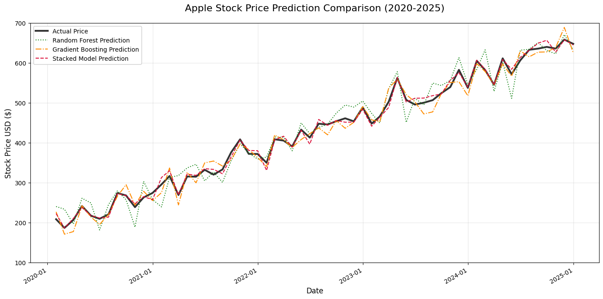

# 📊 Stacked Stock Predictor Model 
Ensemble-based stock price prediction using Random Forest and Gradient Boosting, stacked into a powerful meta-model.

A hybrid stock price forecasting project that integrates the predictive strength of **Random Forest** and **Gradient Boosting** regressors, combined using a **meta-model** (stacking ensemble) to improve performance on stock market prediction tasks.

This project uses historical stock data, computes technical indicators, and evaluates multiple regression models for both individual and stacked performance.

---

## 🔍 Project Highlights

- 📉 **Base Models**: Random Forest Regressor and Gradient Boosting Regressor
- 🧠 **Meta-Model**: Gradient Boosting Regressor using Stacking
- 📅 **Data Source**: Yahoo Finance (`yfinance` package)
- 📊 **Target**: Predicting the **closing price** of stocks (AAPL in this project)
- 📈 **Visualization**: Compare predictions of all models visually

---

---

## 🧪 Workflow Overview

1. **Download stock data** using `yfinance`
2. **Create features**:
   - SMA (5-day, 10-day)
   - Rate of Change (ROC)
   - Daily Returns
3. **Train/Test Split** with TimeSeriesSplit to maintain time dependency
4. **Model Training**:
   - Train individual base models
   - Train stacked meta-model
5. **Evaluation** using:
   - Mean Squared Error (MSE)
   - Mean Absolute Error (MAE)
   - R² Score
6. **Visual Comparison** of model predictions vs. actual stock prices

---

## 📈 Sample Plot

> Model comparison for AAPL: Random Forest vs Gradient Boosting vs Stacked Model

---

## ⚙️ Tech Stack

- Python
- pandas, numpy, matplotlib
- scikit-learn
- yfinance

---

## 📄 License

This project is open-source and available under the MIT License.

